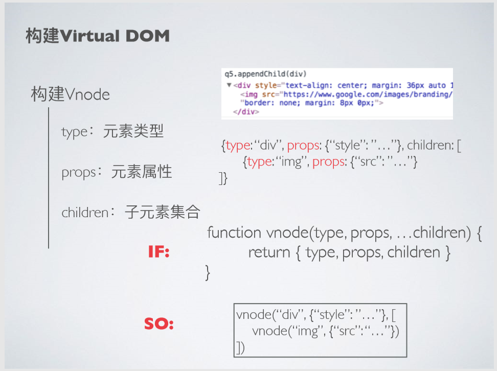
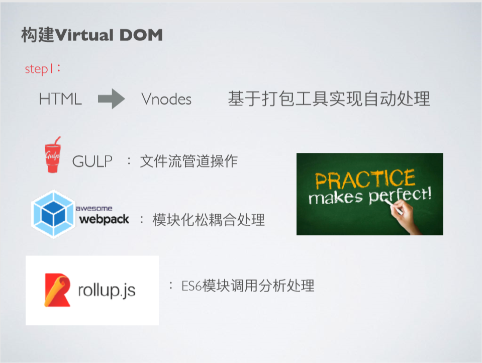

# 课时2  构建Virtual Node
通过上章节的学习，我们知道构建VirtualDOM需要先构建VirtualNode

构建VirtualNode时可以抽象json的数据模型，里面包含的属性分别为：

- type：元素类型
- props：元素属性
- children：子元素集合

可以定义一个抽象的函数为：
function vnode(type,props,...children){
    return {type,props,children}
}

如何构建VirtualDOM

- 将HTML或者HTML片段转换成VNodes，可以基于打包工具实现自动化处理，本文主要讲rollup.js,练习请参考视频学习。

